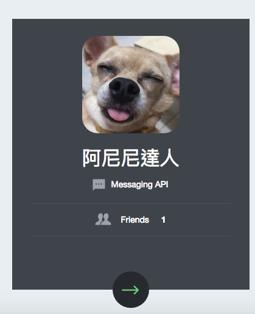
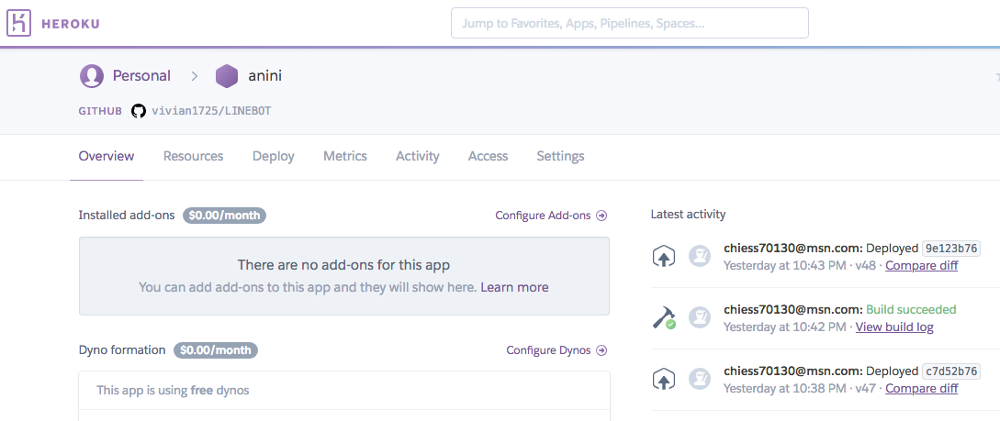
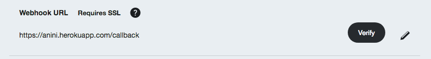
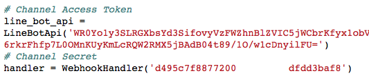
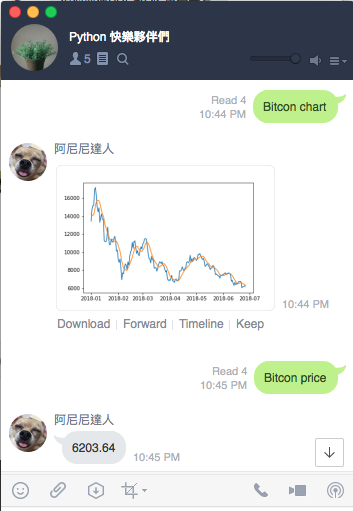

# 建一個LINEBOT 機器人可以查詢目前比特幣價格

#### app.py / Procfile / requirements.txt
--------

#  申請 LINE Messaging API：

### 利用原來LINEID 申請一個 Messaging API 先
### 需要 ISSU Channel secret／Channel access token (long-lived)  之後程式會用到需要先記下來

#  申請 Heroku 將程式佈署上去：

### 先申請帳號
### 並建立一個 APP，自己命名

### 把已命名的APP回填至 申請的Messaging API webHook裡

-------

# 程式說明：

-------

####  requirements.txt ： 需要安裝的元件
####  app.py ： 1.裡頭需對應 Messaging API給的 Channel secret／Channel access token (long-lived)

####                   2.捉取比特幣今日價格，若使用者有詢問時可回覆其價格
####                   3.若使用者有詢問時，可回覆imgur上產生好的比特幣價格trend chart

                 
#### 佈署至Heroku 方法 ：
####                                    1.需先下載Heroku CLI 
####                                    2.確認Local程式位置後
####                                    3.cmd 下指令 （git add. git push heroku master)                     

# 對話畫面：
-------

